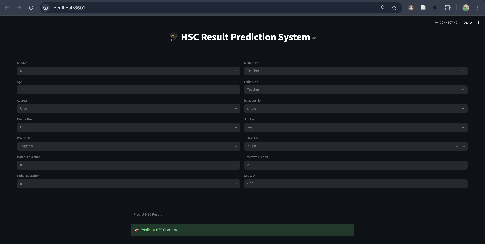

# Bangladeshi Student Performance on HSC Exam

A Machine Learning project that analyzes Bangladeshi students' academic performance and predicts HSC examination marks using different Machine Learning models.

## Features

- Analyze Bangladeshi student performance data
- Predict HSC examination marks
- Data preprocessing and feature scaling
- Interactive Streamlit web application

## Technologies Used

- Python
- Pandas
- NumPy
- Scikit-learn
- Jupyter Notebook
- Streamlit

## Dataset

The project uses a dataset containing information about Bangladeshi students and their academic performance.

## Application Screenshot

